<p align="center">
  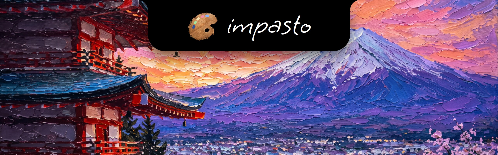
</p>

<p align="center">
  <b>A Hyprland shell whose colours come from a painting.</b><br>
  One black island that changes shape, a desk of widgets under the windows,<br>
  and every program around it repainted by whatever wallpaper is up.
</p>

<p align="center">
  <a href="https://github.com/andreumassanet/impasto/actions/workflows/check.yml"></a>
  
  
  
  <a href="LICENSE"></a>
</p>

<p align="center">
  <a href="#the-island">The island</a> ·
  <a href="#the-bar">The bar</a> ·
  <a href="#the-desktop">The desktop</a> ·
  <a href="#one-palette-everywhere">The palette</a> ·
  <a href="#the-terminal">The terminal</a> ·
  <a href="#installation">Installation</a> ·
  <a href="#keys">Keys</a>
</p>

<p align="center">
  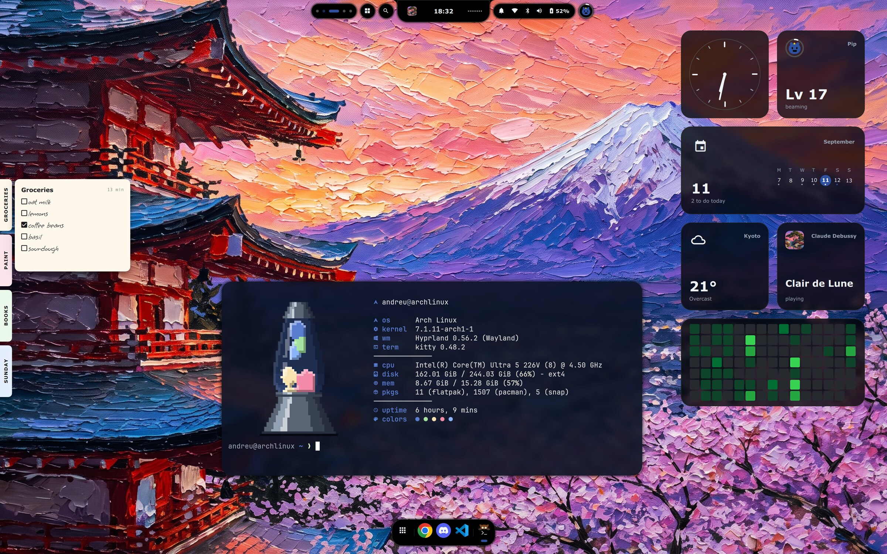
</p>

The name is the technique the wallpapers are painted in: paint laid on thick
enough to keep the mark of the brush. It is a shell first and a dotfiles
repository second — `home/.config/quickshell` is most of the code, and the rest
of `home/` is the desk around it: the terminal, the prompt, two editors, two
file managers, a browser, a chat client, the login screen. **Change the
wallpaper and all of it follows.**

Everything in these pictures is the real shell, photographed.

## The island

<p align="center">
  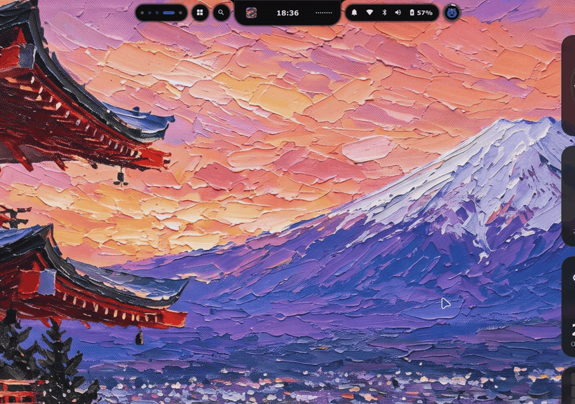
</p>

**The island is one object that changes shape.** A black capsule in the middle
of the bar rests on the time and turns into everything else: the glance under
the pointer, the control centre, the launcher, the overview, a notification, a
game — each the size of what is in it, with no title and no close button. What
is running sits either side of the time, and every module on the bar opens into
the island rather than into a popup of its own.

<p align="center">
  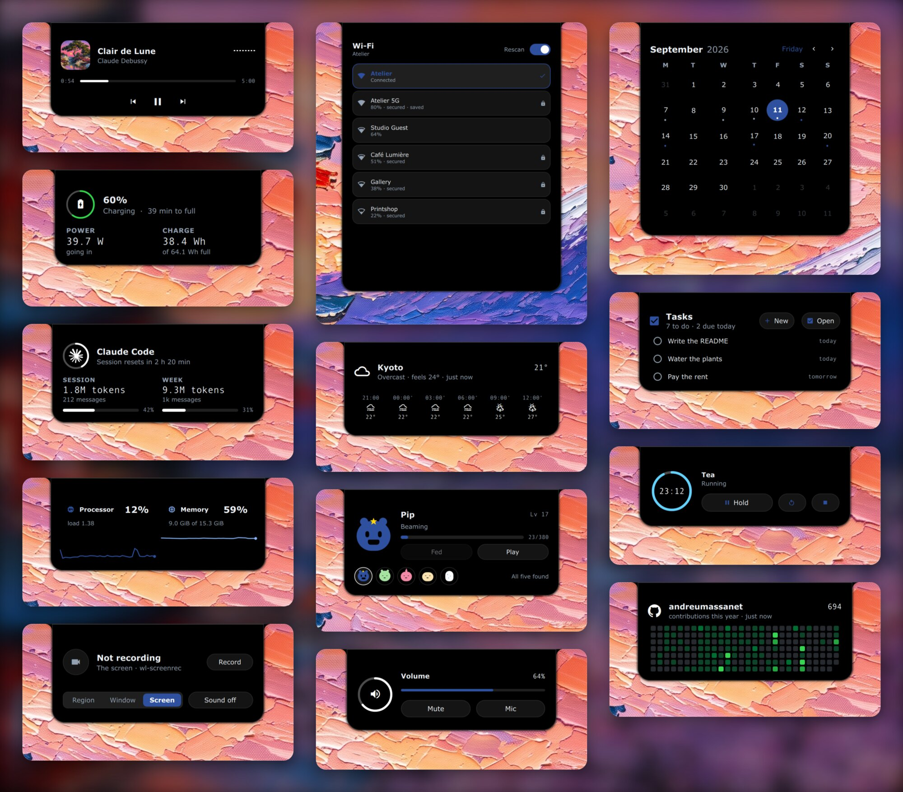
</p>

## The bar

<p align="center">
  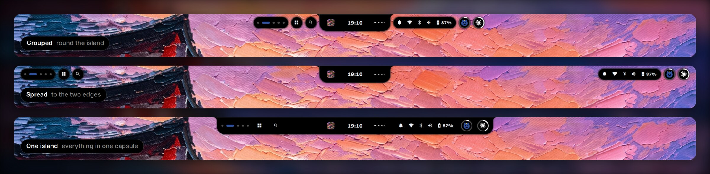
</p>

**Three styles, one layout.** Pieces are dragged out of a catalogue onto a
picture of the bar, then drawn grouped round the island, spread to the edges, or
all inside one capsule. Each shows its symbol or its ring, with its figure
always, never or under the pointer — two settings for the whole bar, and any
piece can have a look of its own.

<p align="center">
  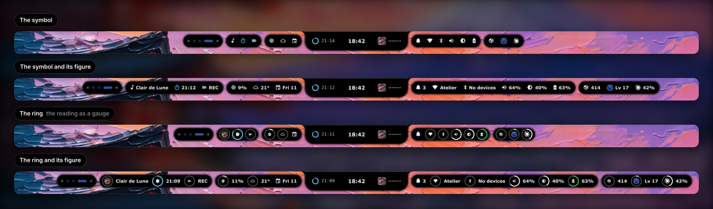
</p>

## The control centre

<p align="center">
  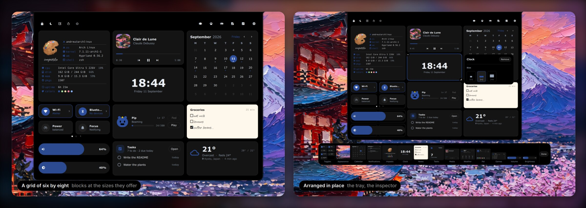
</p>

**A grid you arrange, six columns by eight rows.** Toggles, sliders, the
player, the weather, the month, notifications, a clock, the pet, a note and the
tasks are blocks, dragged from a tray of live miniatures under the island and
given one of the sizes they have a face for.

## The launcher

<p align="center">
  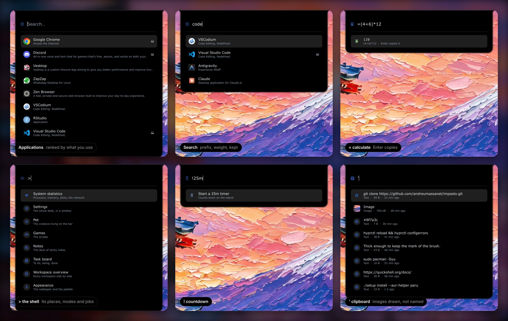 sigil, a countdown, and the clipboard history with an image drawn in its row" width="100%">
</p>

**The first character says what the field is for.** Plain text searches
applications, `=` calculates, `@` finds an open window, `!` starts a countdown,
`'` is the clipboard history, and `>` is the shell itself — every panel and
setting by name. Applications are ranked by what you actually launch, with the
dock's favourites first.

## The desktop

<p align="center">
  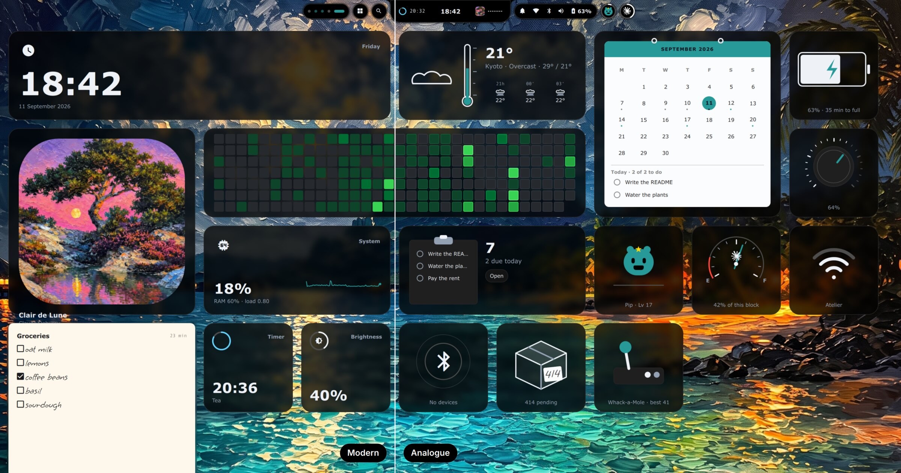
</p>

**Any module can live on the wallpaper**, on a grid, in four shapes: a square,
a card, a large square and a band. Right-click the wallpaper to arrange — a tray
of every module slides up, a corner is pulled for another shape, and a click
opens that widget's own look.

**Two themes on the same modules.** *Modern* is a figure with a caption;
*Analogue* draws each module as an object — a clock with hands, a thermometer, a
wall calendar, a record that turns while it plays, an hourglass. The theme is
one setting for the desk and a choice per widget.

<p align="center">
  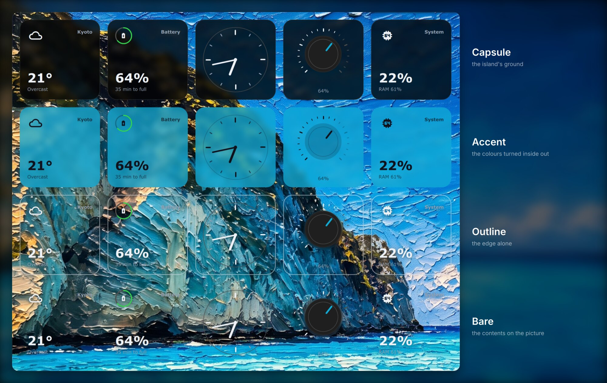
</p>

## Notes and tasks

<p align="center">
  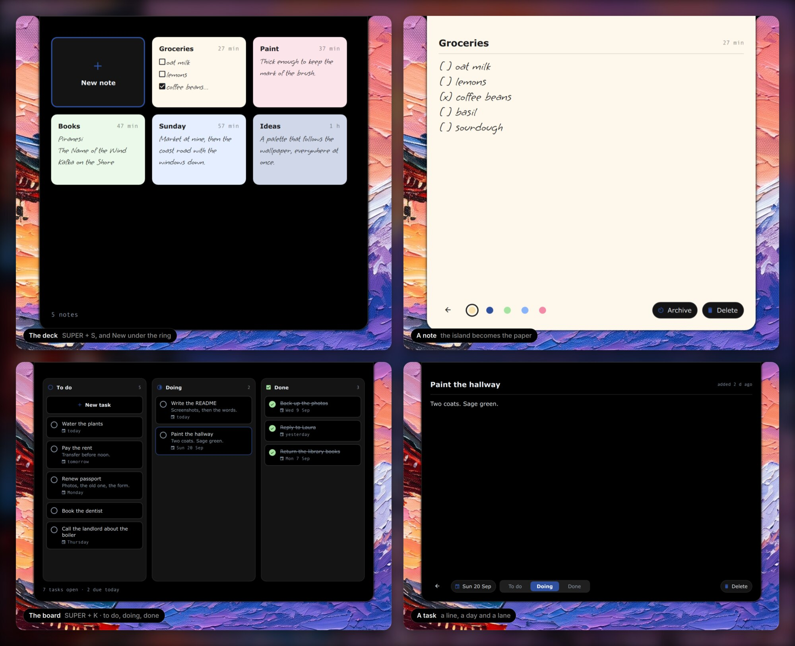
</p>

**A note is paper**: a pastel square with a title and the body in handwriting.
`SUPER + S` opens the deck; on the wallpaper a note sits on a square, or stacks
with others along an edge as tabs that peek out under the pointer.

**A board for what has to be done.** `SUPER + K` is to do, doing, done, with
cards dragged between the lanes, and a task's day shows as a dot under the
month wherever a month is drawn.

## One palette, everywhere

<p align="center">
  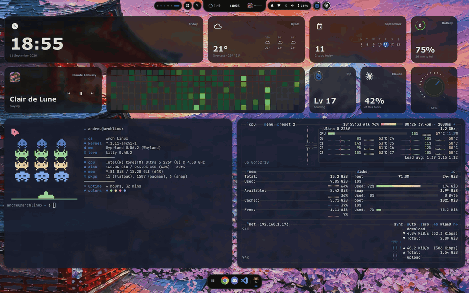
</p>

**The palette comes out of the painting.** Pick a wallpaper and its colours
reach everything at once: the island and the widgets, the terminal and the
prompt, btop, cava, yazi, neovim, VSCodium, the GTK, Qt and KDE windows, Thunar
down to its folders, Vesktop, Zen and Spotify. Or pick one of nine palettes
instead. The desk comes with forty paintings, in the style it is named after.

<p align="center">
  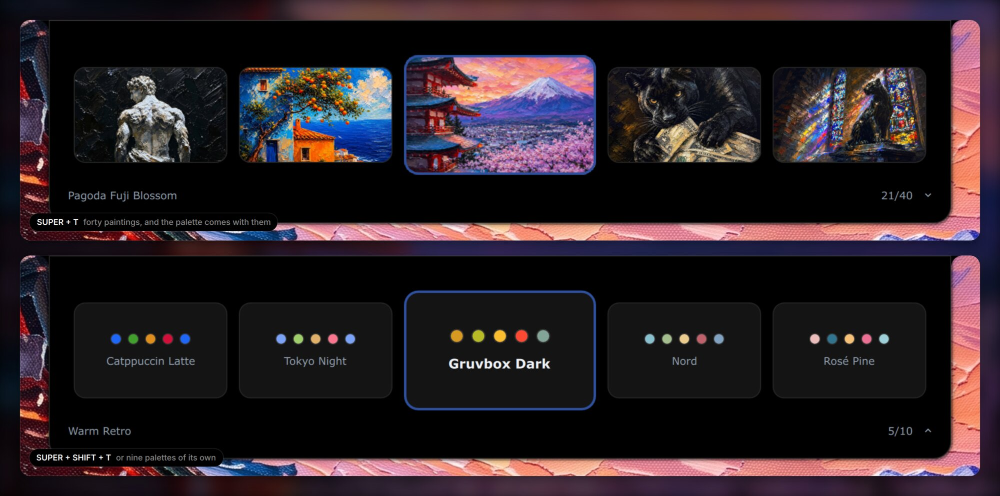
</p>

## The terminal

<p align="center">
  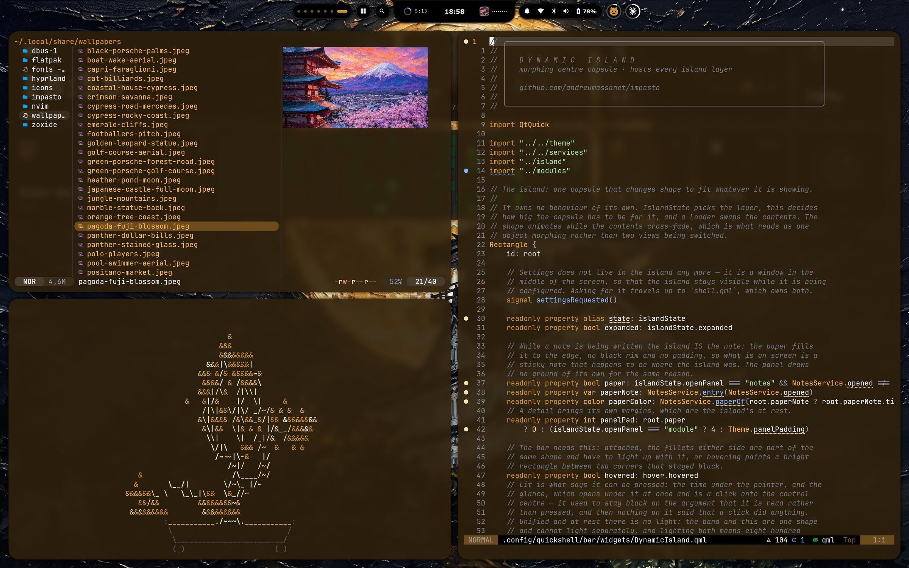
</p>

The terminal wears the island's black with the wallpaper's colour in it. The
prompt is laid out like the bar, and `fa` greets you with fastfetch beside one
of four animated scenes, drawn in pixel art out of the current palette:

<table align="center">
  <tr>
    <td align="center" width="25%">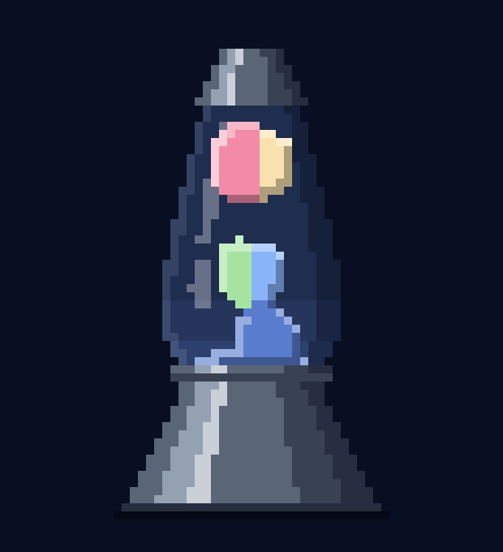<br><sub><code>fa lava</code></sub></td>
    <td align="center" width="25%">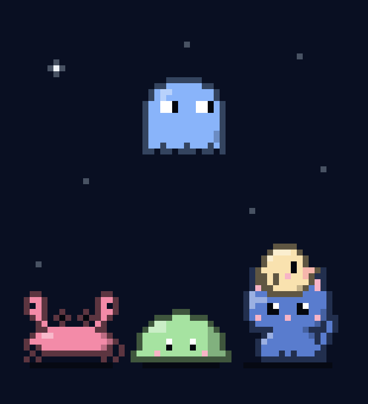<br><sub><code>fa critters</code></sub></td>
    <td align="center" width="25%">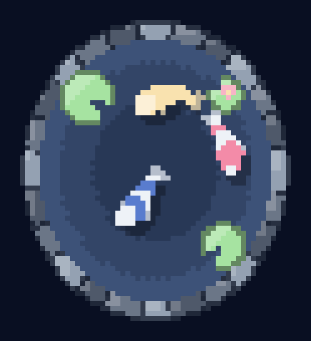<br><sub><code>fa koi</code></sub></td>
    <td align="center" width="25%">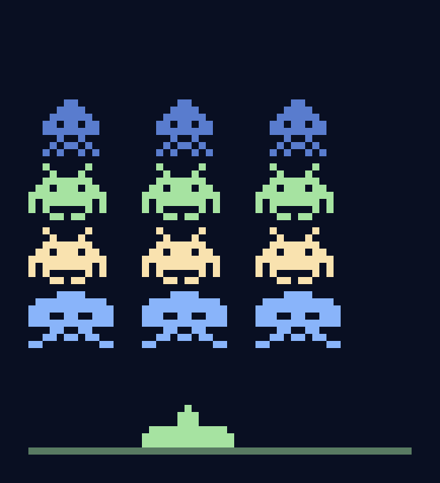<br><sub><code>fa invaders</code></sub></td>
  </tr>
</table>

## Lock and login

<p align="center">
  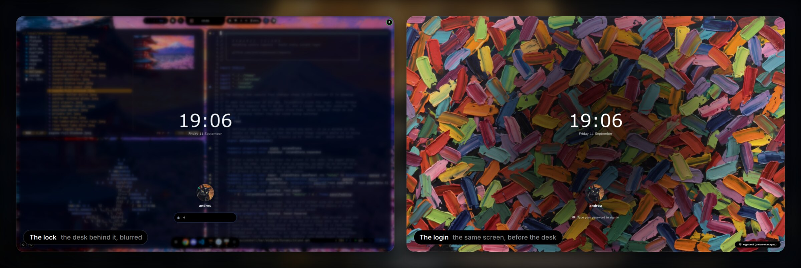
</p>

**The shell locks the session itself**, so the desk stays on screen behind the
lock, blurred, and it is its own idle daemon — lock, screen off and sleep, held
off while a film plays. **The login screen is the lock screen with the desk
taken away**: an SDDM theme with the same clock, the same face and the same
field.

## Settings

<p align="center">
  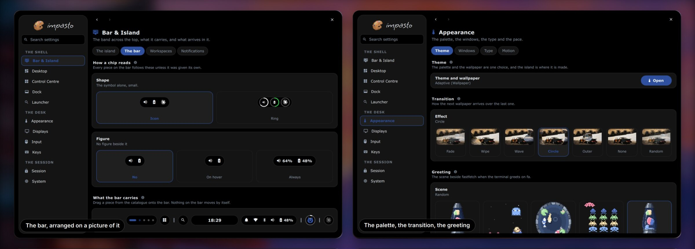
</p>

**Settings is the one panel that is not the island** — an ordinary window,
while the island reacts to what is being changed. Where an option is a shape,
the control is the shape: a real chip, a real bar, the real clock. The window
also speaks Spanish.

**Profiles** keep whole desks under names — the bar, the widgets, the dock, the
look, the keys and the wallpaper — and export to a file you can import on
another machine. Three come with it: *Moon castle*, *Fuji* and *Night bay*.

## The arcade

<p align="center">
  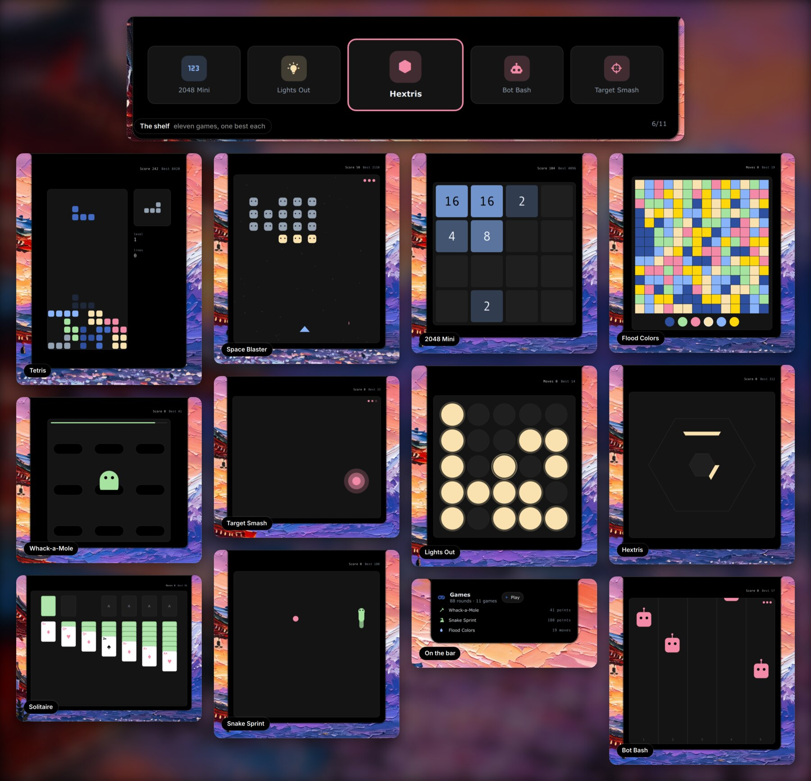
</p>

**Eleven small games, played in the island.** `SUPER + G` opens a shelf; pick a
card and the island becomes that game's board, drawn in the palette's own tints.

## The pets

<p align="center">
  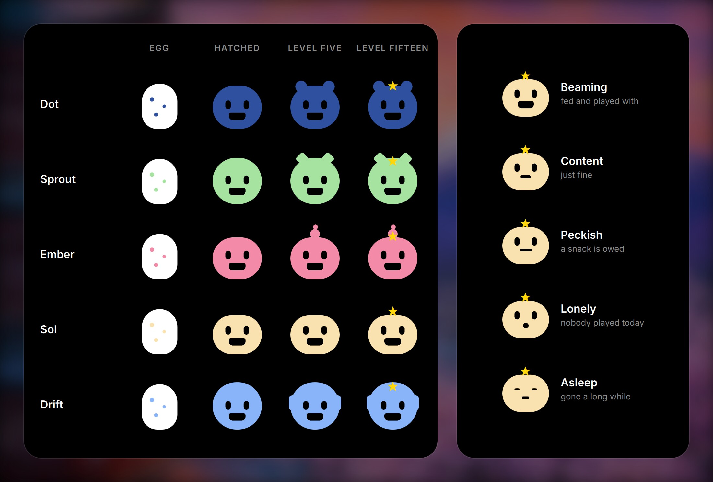
</p>

**A family of five small creatures lives on the bar.** One is out at a time and
earns levels from being fed and played with; each hatches from an egg, and a new
egg arrives as the family grows. Nothing dies, and a week away costs nothing.

## And the rest

<p align="center">
  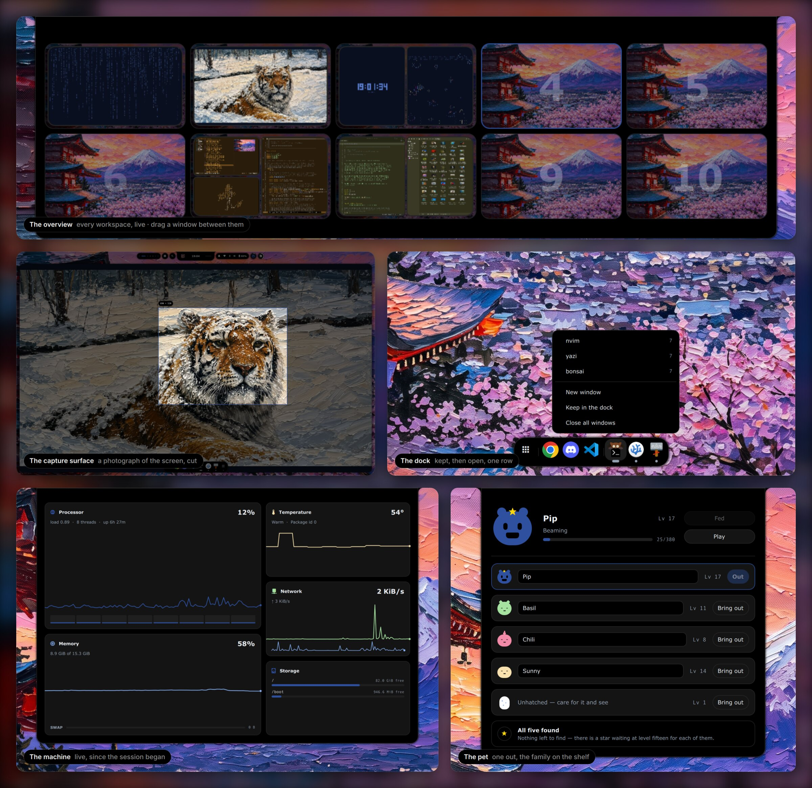
</p>

- **The overview** is every workspace as a live scale model of the screen;
  drag a window from one to another.
- **One key to capture.** `SUPER + SHIFT + S` photographs the screen and lets
  you draw on the photograph — region, window or screen, as a picture or a
  recording, saved, copied, annotated or read as text.
- **The dock** is a shelf on any edge but the top: the applications you keep,
  then whatever else is open.
- **Every key is on one sheet** — `SUPER + H` turns the island into all of them.

## Components

| | | |
|---|---|---|
| 🪟 | Compositor | [Hyprland](https://hypr.land) |
| 🖱️ | Shake to find | [hypr-dynamic-cursors](https://github.com/VirtCode/hypr-dynamic-cursors) |
| 🫧 | Glass on the windows | [hyprglass](https://github.com/hyprnux/hyprglass) |
| 🐚 | Desktop shell | [Quickshell](https://quickshell.org) |
| 🖼️ | Wallpaper daemon | [awww](https://github.com/LGFae/swww) |
| 🖥️ | Terminal | [kitty](https://sw.kovidgoyal.net/kitty/) |
| ⌨️ | Interactive shell | [zsh](https://www.zsh.org) · [oh-my-zsh](https://ohmyz.sh) |
| ❯ | Prompt | [starship](https://starship.rs) |
| 🎨 | Greeting | [fastfetch](https://github.com/fastfetch-cli/fastfetch) |
| 📊 | System monitor | [btop](https://github.com/aristocratos/btop) |
| 🎵 | Audio visualiser | [cava](https://github.com/karlstav/cava) |
| 📁 | File manager | [yazi](https://yazi-rs.github.io) |
| 🗂️ | File manager in a window | [Thunar](https://docs.xfce.org/xfce/thunar/start) |
| ✏️ | Editor | [neovim](https://neovim.io) |
| 📝 | Editor in a window | [VSCodium](https://vscodium.com) |
| 🖼️ | Image viewer | [imv](https://sr.ht/~exec64/imv/) |
| 🪄 | Annotator | [satty](https://github.com/gabm/Satty) |
| 💬 | Chat | [Vesktop](https://github.com/Vencord/Vesktop) |
| 🎧 | Player | [Spotify](https://www.spotify.com) · [spicetify](https://spicetify.app) |
| 🌐 | Browser | [Zen](https://zen-browser.app) |
| 🔑 | Login screen | [SDDM](https://github.com/sddm/sddm) |

## Installation

Arch Linux, and a Hyprland recent enough to read a Lua configuration. Run it
from a terminal inside the Hyprland session — the plugins are built against the
compositor that is running:

```bash
git clone https://github.com/andreumassanet/impasto.git ~/impasto
cd ~/impasto
./setup install
```

It installs the packages, oh-my-zsh, everything in `home/` into your home and
everything in `system/` into `/`, and the two Hyprland plugins, asking for your
password through sudo for pacman and for the copy into `/`.

| Flag | |
|---|---|
| `--skip-packages` | install nothing; copy and build only |
| `--skip-system` | leave `/` alone — no login screen, and no password for it |
| `--skip-plugins` | no shake to find, no glass |
| `--aur-helper yay\|paru` | which helper builds the AUR half — built from the AUR if you have neither |
| `--noconfirm` | take the default at every question |
| `-n`, `--dry-run` | say what would happen, and do none of it |

```bash
./setup update       # git pull, then install again — the same flags
./setup uninstall    # remove everything setup installed that you have not edited since
./setup help         # every verb and flag
```

**Nothing is linked: `setup` copies**, and remembers what it wrote. A file of
yours already in the way is moved to `~/.local/state/impasto/backups/` first; a
file you edit afterwards is left alone, with the new version beside it as
`<name>.new`. Editing the repository itself? `./setup sync` copies it onto the
desk, and `./setup sync --watch` keeps doing it on every save.

<details>
<summary><b>What every package is for</b></summary>
<br>

The packages are two lists, `packages/pacman.txt` and `packages/aur.txt`,
grouped by what each one is for, and `./setup packages` installs whatever of
them is missing — the first with pacman, the second with yay or paru. The first
two sections of the pacman list are the desk itself; every section after them
is one feature, and a line commented out is a package skipped.

The desktop needs `hyprland`, `quickshell`, `awww` and `imagemagick`, and the
terminal `kitty`, `zsh`, `oh-my-zsh`, `starship` and a Nerd Font — the prompt's
arrow is a Nerd Font glyph. `brightnessctl`, `wireplumber`, `nmcli`,
`bluez-utils` and `power-profiles-daemon` back the quick controls; each is
optional and its control disables itself when missing. `hyprsunset` is the
night light, run only while the filter is on.

`xdg-desktop-portal-hyprland` and `xdg-desktop-portal-gtk` are what an
application asks when it wants something it cannot take for itself — screen
sharing in a browser or in Vesktop, and every Open dialog. Neither needs
configuring: the Hyprland backend's default routing is already right, and the
file dialog is GTK3, so it follows the palette.

Captures need `grim` and `wl-clipboard`; `satty` annotates and `tesseract` reads
a region as text, and each one missing takes its own choice off the capture bar.
Recording wants `wf-recorder` or `wl-screenrec` (the second encodes on the GPU,
from the AUR); with neither, the recorder is not on the bar at all. Captures and
recordings land in a folder of their own inside your pictures and videos
folders, whatever your language calls those, and an `XDG_SCREENSHOTS_DIR` or
`XDG_SCREENCASTS_DIR` line in `~/.config/user-dirs.dirs` sends them elsewhere.
`hyprpicker` is the colour under the pointer. The clipboard history needs
nothing more: `wl-paste --watch` is what reads a selection without holding the
keyboard, so there is no `cliphist`.

`fzf`, `zoxide`, `fnm` and `yazi` are reached for by `.zshrc` only if they are
installed; `fastfetch` is the greeting; `btop`, `cava` and `yazi` get their
themes on the first palette push. `unimatrix`, `cbonsai`, `tty-clock` and
`asciiquarium` back the `matrix`, `bonsai` and `clock` aliases and need no
theme, because they draw in the terminal's own colours. `less` is not optional:
it is kitty's scrollback pager.

Two things are Hyprland plugins rather than options, built by `./setup plugins`
with `hyprpm` (which wants `cmake`, `meson`, `cpio`, `git` and `gcc`, a running
Hyprland, and a password — its store is root's). **Shake to find** grows the
pointer when it is shaken; **glass** frosts and bends the blur behind a window,
off by default and switched on in Settings → Appearance. A Hyprland update takes
both away until `hyprpm update` or `./setup plugins` has run. The pointer is a
single vector shape, so it stays sharp when it grows and can take the palette's
colour: `./setup cursors` fetches Bibata's SVGs and `hyprcursor-util` compiles
them.

</details>

<details>
<summary><b>Making the rest of the machine agree</b></summary>
<br>

What opens a file, whether a GTK application comes up dark and which icon theme
it draws are the machine's settings rather than files this repository can
carry, so they are commands, run once:

```bash
xdg-mime default imv.desktop image/jpeg image/png image/gif image/webp image/svg+xml
xdg-mime default nvim.desktop text/plain application/json
xdg-mime default thunar.desktop inode/directory
xdg-mime default zen.desktop application/pdf text/html     # or whichever browser you use
gsettings set org.gnome.desktop.interface color-scheme prefer-dark
gsettings set org.gnome.desktop.interface icon-theme impasto
```

`impasto` is the icon theme the palette push writes: Papirus, with the folders
in the wallpaper's colour. `./setup install` seeds it, so the name resolves
before the shell has ever run.

</details>

<details>
<summary><b>The windows that need one command</b></summary>
<br>

**VSCodium** (`vscodium-bin`) gets its colour theme from the push as a whole
extension in `~/.vscode-oss/extensions/`; nothing has to be installed for that.
Its extensions (all from Open VSX), its font and its chrome are one command, run
with the editor closed — it merges into `settings.json` and keeps whatever else
is in there:

```bash
./setup vscodium
```

**Thunar** takes the palette like every GTK3 window and wants `tumbler`,
`ffmpegthumbnailer`, `gvfs` and `papirus-icon-theme`. Its settings live in
xfconf, a daemon rather than a file, so they are one command too — its toolbar,
its sorting, and five entries in the right-click menu: a terminal here, yazi
here, the editor, the path on the clipboard, and Set as Wallpaper:

```bash
./setup thunar
```

**Spotify** is themed by spicetify, which patches the client rather than reading
a file, so the push writes the colours and stops. This lands them, and is also
the repair after a Spotify update:

```bash
./setup spotify
```

**Zen** (`zen-browser-bin`) needs nothing: the push writes a `userChrome.css`
and the one preference that makes it read it into the profile, and the colours
arrive with the next window. Zen's own workspace theme picker stops having an
effect while this is on. **Vesktop** reads the push's stylesheet once it is
ticked under Vencord's themes. **Qt and KDE windows** need `qt6ct`, which the
push configures; without it they come up in Breeze's light grey.

</details>

<details>
<summary><b>The login screen</b></summary>
<br>

The SDDM theme is `system/`, copied into `/usr/share` by `install` — copied,
because sddm reads its theme as its own user and cannot see into a 0700 home.
`./setup system` does that part on its own. Try it before switching to it:

```bash
sddm-greeter-qt6 --test-mode --theme system/usr/share/sddm/themes/impasto
```

Then set `Current=impasto` under `[Theme]` in whichever file in
`/etc/sddm.conf.d/` sets it. The lock screen and the login screen read one
picture from one place, `/var/lib/impasto/faces/<username>.face.icon`; the
picture itself is yours to put there, and `uninstall` leaves that directory
alone.

`system/` also carries one line for logind: a tap on the power button is left
to the shell, which opens the session menu, instead of powering the machine
off. It applies from the next boot; holding the button is still the
firmware's own forced power-off.

</details>

## Keys

Every key belongs to a profile: Settings → Keys changes any of them, the
compositor's included, and switching profile switches them all. A few worth
knowing first:

- <kbd>SUPER</kbd> <kbd>Return</kbd> a terminal, <kbd>SUPER</kbd> <kbd>Space</kbd>
  the launcher, <kbd>SUPER</kbd> <kbd>Q</kbd> closes the window
- <kbd>SUPER</kbd> <kbd>1</kbd>…<kbd>0</kbd> a workspace, <kbd>SUPER</kbd>
  <kbd>TAB</kbd> all of them at once
- <kbd>SUPER</kbd> <kbd>X</kbd> the session menu, <kbd>SUPER</kbd> <kbd>L</kbd>
  locks
- <kbd>SUPER</kbd> <kbd>H</kbd> every other key, on the island

## Credits

These are worth your time whether or not you use this repository. No code was
copied from any of them; what carried over from the shells are ideas — one file
per island state, one transient signal for every ephemeral event, input
debounced to one frame, and a capture that photographs the screen and draws the
selection on the photograph.

- [saneAspect](https://www.youtube.com/@saneAspect) — the Hyprland setups on
  YouTube that started all this
- [Tide-island](https://github.com/enhaoswen/Tide-island) — the closest thing to
  a complete dynamic island for Hyprland
- [ChillPill-Shell](https://github.com/LUCKYS1NGHH/ChillPill-Shell) — a dynamic
  pill bar built to stay light without a dedicated GPU
- [k4](https://github.com/k4ditano/k4) — a dynamic island bar with a documented
  plugin API
- [HyprQuickshot](https://github.com/JamDon2/hyprquickshot) and its fork
  [HyprQuickFrame](https://github.com/Ronin-CK/HyprQuickFrame) — a capture
  surface in Quickshell
- [diegoMalagrida/dotfiles](https://github.com/diegoMalagrida/dotfiles) — an
  Arch Linux desk ready to install on a fresh system

Built on [Quickshell](https://quickshell.org) and [Hyprland](https://hypr.land).
The pointer is [Bibata](https://github.com/ful1e5/Bibata_Cursor), repainted;
the folders are [Papirus](https://github.com/PapirusDevelopmentTeam/papirus-icon-theme),
re-pointed; the type is [Inter](https://rsms.me/inter/) and
[JetBrains Mono](https://www.jetbrains.com/lp/mono/). Six of the nine palettes
are other people's work, carried as they are:
[Catppuccin](https://catppuccin.com) Mocha and Latte,
[Tokyo Night](https://github.com/folke/tokyonight.nvim),
[Gruvbox](https://github.com/morhetz/gruvbox), [Nord](https://www.nordtheme.com)
and [Rosé Pine](https://rosepinetheme.com).

## License

Copyright © 2026 Andreu Massanet — released under the [GNU GPL-3.0](LICENSE).

You may use, study, change and share any of it. If you build on it and pass the
result on, it stays under the GPL and its source stays available. Keep the
header at the top of each file, which carries this repository's address, and a
line of credit back here is the kind thing to do.
